# qiyu-live-app

> 一个用于学习 Java 微服务、直播互动与异步业务链路的个人后端项目。项目持续迭代中，不以生产可用或高并发压测结论作为目标。

## 项目亮点

- **微服务拆分**：按用户、直播间、礼物、账户、支付、消息、IM、ID 生成等领域拆分 Maven 模块，通过 Dubbo 进行 RPC 调用，并使用 Nacos 管理服务注册与配置。
- **直播互动链路**：实现直播间送礼、全房间 IM 广播、红包雨、PK 积分、在线用户路由等业务能力；消息投递通过 RocketMQ 解耦。
- **资金与支付链路**：实现虚拟币账户、交易流水、充值订单和支付宝沙箱支付回调；支付回调包含签名校验、订单状态校验与重复通知幂等处理。
- **并发场景实践**：购物车使用 Redis Hash 存储 SKU 与数量，库存扣减使用 Lua 脚本保证 Redis 操作原子性；异步消费链路围绕业务唯一标识处理重复投递。
- **IM 长连接**：基于 Netty 提供 TCP、WebSocket 接入，通过 IM Router 将单播与批量广播消息路由至目标 IM Server。

## 技术栈

| 分类 | 技术 |
| --- | --- |
| 开发语言与构建 | Java 21、Maven、多模块工程 |
| 微服务 | Spring Boot、Spring Cloud Alibaba、Nacos、Gateway、Dubbo |
| 数据存储 | MySQL、MyBatis-Plus、Redis、MongoDB、ShardingSphere-JDBC |
| 消息与通信 | RocketMQ、Netty、TCP、WebSocket |
| 支付与直播 | 支付宝沙箱 SDK、SRS、OBS 推流、HLS 播放 |
| 工程化 | Docker、Docker Compose、Git、IDEA、Postman/Apifox |

## 已实现业务

| 领域 | 主要能力 |
| --- | --- |
| 用户 | 登录、验证码、用户资料、标签与用户信息查询 |
| 直播间 | 开播、关播、直播间查询、在线用户维护、PK 匹配与积分状态 |
| IM | 用户连接绑定、单播、批量广播、消息 ACK、TCP/WebSocket 接入 |
| 礼物与红包 | 礼物配置、送礼消费、直播间礼物特效广播、红包雨配置与领取 |
| 账户与支付 | 虚拟币账户、充值/消费流水、支付订单、支付宝沙箱异步回调 |
| 直播电商 | 购物车、SKU 查询、预下单、Redis Lua 库存扣减与库存回滚 |

## 架构概览

```text
Web / OBS
    |
Gateway / API ---- Dubbo + Nacos ---- User / Account / Gift / Living / Bank / Message / ID Provider
    |                                     |
    |                                     +---- RocketMQ ---- 异步送礼、红包、库存等消费链路
    |
IM Core Server <---- IM Router -----------+
    |
TCP / WebSocket

MySQL / Redis / MongoDB / SRS
```

## 快速开始

### 环境要求

- JDK 21
- Maven 3.9+
- MySQL、Redis、MongoDB、RocketMQ、Nacos
- Docker Desktop（用于容器化练习环境）
- SRS 与 OBS（验证推流播放时需要）

### 编译

```powershell
mvn -s .mvn/settings.xml -DskipTests package
```

### 配置与启动

1. 在 Nacos 创建并维护各服务对应的 `Data ID` 配置，真实密码和支付宝密钥不得提交到仓库。
2. 启动 MySQL、Redis、MongoDB、RocketMQ、Nacos 等基础设施。
3. 按业务需要启动 Provider、IM Core、API 和 Gateway。
4. 通过 Gateway 调用 HTTP 接口；WebSocket 地址以 `qiyu-live-im-core-server` 的 Nacos 配置为准。

详细的 IM 联调参考：[docs/im-local-startup-and-debug.md](./docs/im-local-startup-and-debug.md)。

### 公开仓库配置

此仓库中的 Nacos YAML 和 Docker 环境变量文件均为脱敏模板，不能直接当作真实环境配置使用。

1. 复制 [`.env.docker.example`](./.env.docker.example) 为 `.env.docker`，填写本机基础设施密码和支付宝沙箱配置。
2. 以 [`docs/nacos-configs`](./docs/nacos-configs) 的模板创建 Nacos Data ID，并通过环境变量或 Nacos 填入真实值。
3. 支付宝 `app-private-key`、公网回调地址、数据库密码只保存在本机或部署平台的密钥管理中。

变量说明和发布前检查见：[公开配置说明](./docs/public-configuration.md)。

## Docker 部署进度

当前 Docker Compose 用于本机练手：复用已有 Redis、RocketMQ、MySQL、SRS 容器，`docker-compose.infra.yml` 提供 MongoDB，`docker-compose.app.yml` 提供 Java 服务编排。Nacos 目前仍按宿主机服务接入。部署过程和约束见：

[本机 Docker Compose 部署实施说明](./docs/2026-09-03-docker-compose-local-deployment-claude-code-guide.md)

> Docker 部署尚在实施阶段。当前不应将项目描述为“已完成生产环境部署”。

## 后续计划

- [ ] 完成 Nacos、MongoDB 与全部 Java 服务的统一 Docker Compose 编排
- [ ] 验证支付宝沙箱支付创建订单、异步通知及重复回调幂等
- [ ] 完成红包雨全链路运行验证
- [ ] 完成 PK 到期结算、状态同步与前端展示联调
- [ ] 补充关键异步链路的自动化测试

## 项目总览

`qiyu-live-app` 是一套基于 Spring Boot、Dubbo、Nacos、Redis、MongoDB、RocketMQ 和 Netty 的直播 IM 后端工程。

仓库按 Maven 子模块拆分，分层如下：

- `*-interface`：RPC 契约、DTO、枚举、常量
- `*-provider`：业务实现、Dubbo 暴露、HTTP 暴露
- `qiyu-live-framework-*`：基础设施自动配置和通用能力
- `qiyu-live-im-*`：IM 长连接、登录绑定、路由投递
- `qiyu-live-gateway`：统一入口和转发
- `qiyu-live-api`：对外 HTTP API 编排层

## 模块依赖图

```mermaid
graph TD
  Root["qiyu-live-app"]
  API["qiyu-live-api"]
  GW["qiyu-live-gateway"]
  UserI["qiyu-live-user-interface"]
  UserP["qiyu-live-user-provider"]
  AccI["qiyu-live-account-interface"]
  AccP["qiyu-live-account-provider"]
  MsgI["qiyu-live-msg-interface"]
  MsgP["qiyu-live-msg-provider"]
  IdI["qiyu-live-id-generate-interface"]
  IdP["qiyu-live-id-generate-provider"]
  IMI["qiyu-live-im-interface"]
  IMP["qiyu-live-im-provider"]
  IMC["qiyu-live-im-core-server"]
  IMCI["qiyu-live-im-core-server-interfaces"]
  IMRI["qiyu-live-im-router-interfaces"]
  IMRP["qiyu-live-im-router-provider"]
  Fw["qiyu-live-framework"]
  FwDS["qiyu-live-framework-datasource-starter"]
  FwR["qiyu-live-framework-redis-starter"]
  FwMQ["qiyu-live-framework-mq-starter"]
  FwW["qiyu-live-framework-web-starter"]
  LivingI["qiyu-live-living-interfaces"]
  LivingP["qiyu-live-living-provider"]
  Common["qiyu-live-common-interfacce"]

  Root --> API
  Root --> GW
  Root --> UserP
  Root --> AccP
  Root --> MsgP
  Root --> IdP
  Root --> IMP
  Root --> IMC
  Root --> IMRP
  Root --> LivingP
  Root --> Fw

  API --> UserI
  API --> AccI
  API --> MsgI
  API --> Common
  API --> FwW

  GW --> AccI
  GW --> Common

  UserP --> UserI
  UserP --> Common
  UserP --> FwDS
  UserP --> FwR
  UserP --> FwMQ

  AccP --> AccI
  AccP --> Common
  AccP --> FwDS

  MsgP --> MsgI
  MsgP --> Common
  MsgP --> FwMQ

  IdP --> IdI
  IdP --> FwDS

  IMP --> IMI
  IMP --> Common
  IMP --> FwR
  IMP --> FwMQ

  IMC --> IMI
  IMC --> IMCI
  IMC --> IMRP
  IMC --> FwR
  IMC --> FwMQ

  IMRP --> IMRI
  IMRP --> IMCI
  IMRP --> IMI
  IMRP --> FwR

  Fw --> FwDS
  Fw --> FwR
  Fw --> FwMQ
  Fw --> FwW

  API --> LivingP

  MsgP --> LivingI

  LivingP --> LivingI
  LivingP --> Common
  LivingP --> FwR
  LivingP --> FwMQ
  LivingP --> IMCI

  LivingI --> Common
```



## 模块索引

### 业务入口

- [qiyu-live-api/README.md](./qiyu-live-api/README.md)
- [qiyu-live-gateway/README.md](./qiyu-live-gateway/README.md)

### 用户与账号

- [qiyu-live-user-interface/README.md](./qiyu-live-user-interface/README.md)
- [qiyu-live-user-provider/README.md](./qiyu-live-user-provider/README.md)
- [qiyu-live-account-interface/README.md](./qiyu-live-account-interface/README.md)
- [qiyu-live-account-provider/README.md](./qiyu-live-account-provider/README.md)

### 直播间

- [qiyu-live-living-interfaces/README.md](./qiyu-live-living-interfaces/README.md)
- [qiyu-live-living-provider/README.md](./qiyu-live-living-provider/README.md)

### 礼物

- [qiyu-live-gift-interface/README.md](./qiyu-live-gift-interface/README.md)
- [qiyu-live-gift-provider/README.md](./qiyu-live-gift-provider/README.md)

### ID、消息与公共包

- [qiyu-live-id-generate-interface/README.md](./qiyu-live-id-generate-interface/README.md)
- [qiyu-live-id-generate-provider/README.md](./qiyu-live-id-generate-provider/README.md)
- [qiyu-live-msg-interface/README.md](./qiyu-live-msg-interface/README.md)
- [qiyu-live-msg-provider/README.md](./qiyu-live-msg-provider/README.md)
- [qiyu-live-common-interfacce/README.md](./qiyu-live-common-interfacce/README.md)

### IM 链路

- [qiyu-live-im-interface/README.md](./qiyu-live-im-interface/README.md)
- [qiyu-live-im-provider/README.md](./qiyu-live-im-provider/README.md)
- [qiyu-live-im-core-server-interfaces/README.md](./qiyu-live-im-core-server-interfaces/README.md)
- [qiyu-live-im-core-server/README.md](./qiyu-live-im-core-server/README.md)
- [qiyu-live-im-router-interfaces/README.md](./qiyu-live-im-router-interfaces/README.md)
- [qiyu-live-im-router-provider/README.md](./qiyu-live-im-router-provider/README.md)

### 基础设施

- [qiyu-live-framework/README.md](./qiyu-live-framework/README.md)
- [qiyu-live-framework/qiyu-live-framework-datasource-starter/README.md](./qiyu-live-framework/qiyu-live-framework-datasource-starter/README.md)
- [qiyu-live-framework/qiyu-live-framework-redis-starter/README.md](./qiyu-live-framework/qiyu-live-framework-redis-starter/README.md)
- [qiyu-live-framework/qiyu-live-framework-mq-starter/README.md](./qiyu-live-framework/qiyu-live-framework-mq-starter/README.md)
- [qiyu-live-framework/qiyu-live-framework-web-starter/README.md](./qiyu-live-framework/qiyu-live-framework-web-starter/README.md)

## 联调与设计文档

| 文档 | 说明 |
|------|------|
| [docs/im-local-startup-and-debug.md](./docs/im-local-startup-and-debug.md) | IM 本地启动、联调和验收命令 |
| [docs/request-limit-strategy.md](./docs/request-limit-strategy.md) | 请求限流策略：分级逻辑、各接口配置、Redis Key 设计 |

## 维护约定

- 每个 Maven 子模块保留一个 `README.md`
- 读文档先看根目录总览，再看模块 README，再看 `docs/` 下的专题文档
- `src/main/resources/archetype-resources` 和 `META-INF/maven` 这类目录属于模板或历史资源，不当成运行入口
