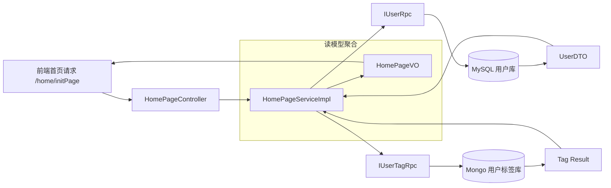

# 首页聚合与用户标签操作手册

本文档用于指导 `qiyu-live-api` 中首页聚合逻辑的设计、修改和后续用 Codex 继续写代码的流程。

## 1. 当前目标

首页接口需要完成两件事：

- 返回用户基础信息
- 返回“是否展示开播按钮”这种聚合后的权限结果

其中：

- 用户基础资料来自 MySQL 用户域
- 用户标签来自 Mongo 标签域
- 首页只做聚合，不直接操作数据库

## 2. 架构图

## 3. 职责边界

### 3.1 Controller

- 只负责接收请求和返回结果
- 不做跨库逻辑
- 不做权限判断

### 3.2 Service

- 负责聚合 MySQL 用户信息和 Mongo 标签结果
- 负责把“是否展示开播按钮”这样的业务语义组装进 `HomePageVO`

### 3.3 用户域

- 负责用户主数据
- 负责分库分表路由
- 上层只通过 `userId` 调用，不关心具体分片

### 3.4 标签域

- 负责标签存储和查询
- 负责标签 bit 位或标签快照的读写
- `VIP` 这类权限型标签如果继续保留在标签域，也应作为“权限派生结果”使用

## 4. 这次已经处理的点

- `HomePageVO` 增加了 `showStartLivingBtn`
- `HomePageServiceImpl` 现在会返回 `homePageVO`
- `showStartLivingBtn` 的值来自 `userTagRpc.containTag(userId, UserTagsEnum.IS_VIP)`

## 5. 以后怎么用 Codex 改这类代码

建议固定按下面顺序让 Codex 工作：

### 5.1 第一轮：先读，不先改

让 Codex 先看这些文件：

- `qiyu-live-api/src/main/java/org/qiyu/live/api/controller/HomePageController.java`
- `qiyu-live-api/src/main/java/org/qiyu/live/api/service/impl/HomePageServiceImpl.java`
- `qiyu-live-api/src/main/java/org/qiyu/live/api/vo/HomePageVO.java`
- `qiyu-live-user-interface/src/main/java/org/qiyu/live/user/interfaces/interfaces/IUserRpc.java`
- `qiyu-live-user-interface/src/main/java/org/qiyu/live/user/interfaces/interfaces/IUserTagRpc.java`
- `qiyu-live-user-interface/src/main/java/org/qiyu/live/user/interfaces/constants/UserTagsEnum.java`

### 5.2 第二轮：确认数据归属

先问清楚每个字段属于哪个域：

- MySQL 用户主档
- Mongo 标签画像
- 会员/权益
- 首页聚合展示字段

### 5.3 第三轮：再改 VO，再改 Service

修改顺序建议是：

1. 先改 `VO`
2. 再改 `Service`
3. 再改 `Controller`
4. 最后补前端字段消费

这样可以避免“service 已经写了，但 VO 没有字段”的断链问题。

## 6. 改标签时的规则

如果以后新增用户标签，按这个顺序处理：

1. 先确认标签是“权限类”还是“画像类”
2. 如果是 bit 位标签，先改 `tag-bit-registry.yaml`
3. 再改 `UserTagsEnum`
4. 再改 `IUserTagRpc` / `IUserTagService`
5. 再改 Mongo 持久化逻辑
6. 最后改调用方的 VO 或展示逻辑

## 7. 改首页时的规则

首页只做聚合，不做这些事情：

- 不直接访问 Mongo 集合
- 不直接访问 MySQL 表
- 不直接知道分库分表规则
- 不把权限判断散落在前端

首页应该只消费以下内容：

- 用户基础信息
- 登录状态
- 权限结果
- 标签摘要

## 8. 用 Codex 写代码时的推荐提示词

你以后可以直接这样描述任务：

> 请先阅读 `HomePageController`、`HomePageServiceImpl`、`HomePageVO` 和相关 RPC 接口，确认字段归属后，再修改代码。首页只做聚合，不直接碰数据库。若要新增展示字段，先补 VO，再补 service，再补调用方。

## 9. 代码验证清单

每次改完建议检查：

- `HomePageServiceImpl` 是否有 `return null`
- `HomePageVO` 是否已有对应字段
- 标签判断是否只通过标签服务做
- 用户信息是否只通过用户 RPC 获取
- 是否避免了跨库 join
- 是否保留了后续扩展标签的空间

## 10. 设计建议

如果后面你要继续扩展，建议把首页聚合再拆成两个层：

- `HomePageService`：只做首页聚合
- `UserPermissionService`：专门判断是否可开播、是否可进阶使用某些能力

这样以后“VIP 能开播”“某些标签能参加活动”“某些等级能进直播间管理”都能统一走权限层，不会把规则散在首页代码里。
